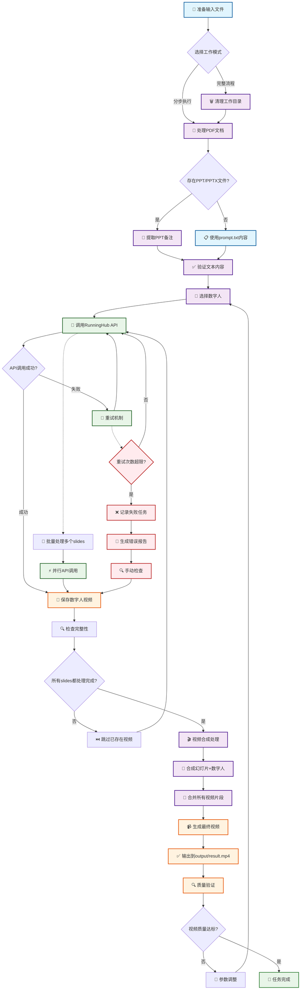

# 🎬 AI视频生成器

[](https://www.python.org/)
[](https://github.com/astral-sh/uv)
[](https://opensource.org/licenses/MIT)

一个基于AI的视频内容生成自动化工具，帮助内容创作者、教育工作者和博主快速制作包含数字人讲解的专业视频。

## ✨ 核心功能

- 📄 **PDF转幻灯片**: 自动将PDF演示文稿转换为高清PNG图片序列
- 📝 **智能脚本提取**: 从PPT备注中提取演讲脚本，支持AI生成内容
- 🤖 **数字人视频生成**: 集成RunningHub API生成数字人讲解视频
- 🎞️ **视频合成**: 将幻灯片与数字人视频完美合成
- 🎨 **PPT自动生成**: 通过Gamma API根据提示词自动生成演示文稿
- 🎮 **Web管理界面**: 可视化数字人管理器，支持批量上传、预览和配置
- 🔄 **灵活工作流**: 支持完整流程或分步执行
- 📊 **详细日志**: 完善的日志记录和错误处理机制

## 🎯 适用场景

- 📚 **在线教育**: 制作课程讲解视频
- 🎪 **内容创作**: 网红博主视频内容制作
- 💼 **企业培训**: 内部培训和产品介绍
- 📺 **知识分享**: 专业知识和技能分享视频
- 🎭 **自媒体**: 各种主题的短视频制作

## 📋 工作流程

### 1. 准备内容脚本
使用AI工具（如Grok）生成10页左右的中文讲稿：

```bash
# 提示词模板
<你要讨论的议题>请搜索互联网寻找真相。请帮我生成一份10页的中文讲话稿，内容要适合网红博主<你的名字>口头讲的，要吸引人，要口语化。第一页是导入，最后一页是感谢。每一页用\n---\n分隔，每一页的内容只包含需要讲的内容，不要有其他脚本、标题内容
```

### 2. 自动化处理
- 清理工作目录
- 处理PDF/PPT文件
- 生成数字人视频
- 合成最终视频

### 3. 输出成果
获得包含专业数字人讲解的完整视频文件

📖 **详细内容样例**: 参考 `assets/prompt.txt` 中的完整讲稿示例

## 🚀 快速开始

### 环境要求

- **Python**: 3.12 或更高版本
- **操作系统**: Windows 10/11, macOS 10.15+, Ubuntu 20.04+
- **内存**: 至少 4GB RAM
- **存储空间**: 至少 5GB 可用空间
- **网络**: 稳定的互联网连接

### 安装步骤

#### 1. 克隆项目
```bash
git clone <your-repo-url>
cd video-generator
```

#### 2. 安装uv包管理器
```bash
# Windows (PowerShell)
powershell -c "irm https://astral.sh/uv/install.ps1 | iex"

# macOS/Linux
curl -LsSf https://astral.sh/uv/install.sh | sh
```

#### 3. 安装依赖
```bash
uv sync
```

#### 4. 配置环境变量
```bash
# 复制环境变量模板
cp env.example .env

# 编辑 .env 文件，填入你的API密钥
```

### API配置说明

在 `.env` 文件中配置以下API密钥：

```env
# RunningHub API配置 (必需)
RUNNINGHUB_API_KEY=your_runninghub_api_key
RUNNINGHUB_BASE_URL=https://www.runninghub.cn
RUNNINGHUB_WEBAPP_ID=your_webapp_id

# WebApp ID配置 (可选)
short_webappId=your_short_webapp_id
portrait_webappId=your_portrait_webapp_id
landscape_webappId=your_landscape_webapp_id

# Gamma API配置 (可选，用于自动生成PPT)
gamma_api_key=your_gamma_api_key
```

#### 获取API密钥

1. **RunningHub API**:
   - 访问 [RunningHub官网](https://www.runninghub.cn)
   - 注册账号并获取API密钥
   - 创建WebApp ID

2. **Gamma API** (可选):
   - 访问 [Gamma.app](https://gamma.app)
   - 注册账号并获取API密钥

## 📖 使用方法

### 🎯 快速上手

第一次使用推荐按以下顺序操作：

```bash
# 1. 准备输入文件
# 将你的讲稿保存到 input/prompt.txt
# 将PDF文件放到 input/ 目录

# 2. 运行完整流程
uv run python main.py
```

### 🔧 命令行选项详解

#### 完整工作流程
```bash
# 使用默认数字人 (man)
uv run python main.py

# 指定使用特定数字人
uv run python main.py --digital-human woman
```
**执行步骤**：
1. 🗑️ 可选择清空slides和output目录
2. 📄 处理input目录中的PDF文件
3. 📝 提取PPT备注内容
4. 🤖 生成数字人视频（使用指定的数字人）
5. 🎬 合成最终视频

#### 分步执行选项

**🧹 清理工作目录**
```bash
uv run python main.py --clear
```
清空slides和output目录中的所有文件

**📄 PDF转幻灯片**
```bash
uv run python main.py --pdf
```
- 将input目录中的第一个PDF文件转换为1920x1080的PNG图片
- 输出到slides目录，命名为1.png, 2.png...

**📝 提取PPT备注**
```bash
uv run python main.py --ppt
```
- 查找与PDF同名的PPT/PPTX文件
- 提取每页的备注内容
- 保存为对应的txt文件（1.txt, 2.txt...）

**🤖 生成数字人视频**
```bash
# 使用默认数字人 (man)
uv run python main.py --generate

# 指定使用特定数字人
uv run python main.py --generate --digital-human woman
```
- 为每个slide生成数字人讲解视频
- 支持跳过已存在的视频文件
- 自动处理重试和错误恢复
- 可通过`--digital-human`参数指定数字人（默认：man）

**🎬 合成最终视频**
```bash
uv run python main.py --batch
```
- 将幻灯片图片与数字人视频合成
- 生成output/result.mp4最终视频文件

**👥 数字人管理**
```bash
# 上传指定数字人
uv run python main.py --upload man

# 批量上传所有数字人
uv run python main.py --upload all

# 生成视频时指定数字人
uv run python main.py --digital-human woman
```

**🎭 数字人选择**
```bash
# 查看帮助信息
uv run python main.py --help

# 使用不同的数字人
uv run python main.py --digital-human man      # 使用男性数字人（默认）
uv run python main.py --digital-human woman    # 使用女性数字人
uv run python main.py --digital-human custom   # 使用自定义数字人
```

**🎮 数字人Web管理器**
```bash
# 启动数字人管理Web界面
uv run digital-human-web-manager.py
```
- 🌐 在浏览器中访问 `http://localhost:7860`
- 📊 可视化管理所有数字人资源
- 📤 批量上传数字人到服务器
- 👁️ 预览数字人的图片和音频文件
- ⚙️ 查看和管理数字人配置信息
- ➕ 通过Web界面创建新数字人

**📺 B站视频上传**
```bash
# 使用biliup上传视频到B站
.\biliup\biliup_win.exe upload -c ..\assets\biliconfig.yaml
```
- 📹 自动上传output目录中的视频文件
- ⚙️ 使用配置文件设置视频参数
- 🏷️ 自动添加标题、简介、标签等信息
- 🎵 支持杜比音效和Hi-Res音频
- 📱 指定投稿分区和封面
- 🔄 支持批量上传多个视频文件

### 📋 实用工作流程示例

#### 🎬 标准视频制作流程
```bash
# 准备阶段
uv run python main.py --clear          # 清理目录
uv run python main.py --pdf            # 处理PDF
uv run python main.py --ppt            # 提取备注

# 生成阶段
uv run python main.py --generate       # 生成数字人视频（使用默认数字人）

# 合成阶段
uv run python main.py --batch          # 合成最终视频
```

#### 🎭 使用不同数字人的流程
```bash
# 使用女性数字人制作视频
uv run python main.py --digital-human woman

# 或者分步执行
uv run python main.py --clear
uv run python main.py --pdf
uv run python main.py --ppt
uv run python main.py --generate --digital-human woman
uv run python main.py --batch
```

#### 🔄 快速重新生成
```bash
# 仅重新生成视频（不重新处理PDF/PPT）
uv run python main.py --generate                    # 使用默认数字人
uv run python main.py --generate --digital-human woman  # 使用指定数字人
uv run python main.py --batch
```

#### 🎨 使用自动生成的PPT
```bash
# 从prompt.txt自动生成PPT
uv run python main.py --create-ppt

# 然后继续正常流程
uv run python main.py --pdf
uv run python main.py --generate --digital-human woman  # 指定数字人
uv run python main.py --batch
```

#### 📺 完整视频制作与发布流程
```bash
# 1. 视频制作阶段
uv run python main.py --digital-human woman  # 完整制作流程

# 2. 视频上传阶段
.\biliup\biliup_win.exe upload -c ..\assets\biliconfig.yaml
```

#### 🔄 批量制作与上传流程
```bash
# 制作多个视频
uv run python main.py --digital-human man
uv run python main.py --digital-human woman

# 批量上传到B站
.\biliup\biliup_win.exe upload -c ..\assets\biliconfig.yaml
```

### 📁 文件准备指南

#### 输入文件结构
```
input/
├── presentation.pdf      # 演示文稿PDF文件
├── presentation.pptx     # 对应的PPT文件（可选，用于提取备注）
└── prompt.txt           # AI生成的讲稿内容
```

#### 讲稿格式要求
- 使用 `---` 分隔不同页面
- 每页内容要口语化，适合口头表达
- 第一页为开场白，最后一页为感谢
- 保持在10页左右为佳

示例格式：
```
大家好，我是Clark，今天我们来聊聊AI技术...

---

首先，让我们看看AI的发展历程...

---

最后，感谢大家的收看，我们下次再见！
```

## 📂 项目架构

### 目录结构
```
video-generator/
├── 📁 input/              # 输入文件目录
│   ├── presentation.pdf   # 演示文稿PDF
│   ├── presentation.pptx  # PPT文件（可选）
│   └── prompt.txt         # AI生成的讲稿
├── 📁 slides/             # 幻灯片处理目录
│   ├── 1.png, 2.png...    # PDF转换的图片
│   ├── 1.txt, 2.txt...    # 提取的文本内容
│   └── 1.mp4, 2.mp4...    # 生成的数字人视频
├── 📁 output/             # 最终输出目录
│   └── result.mp4         # 合成的完整视频
├── 📁 biliup/             # B站上传工具目录
│   ├── biliup_win.exe     # Windows版B站上传工具
│   ├── biliup_macos       # macOS版B站上传工具
│   └── cookies.json       # B站登录凭证文件
├── 📁 characters/         # 数字人配置目录
├── 📁 lib/                # 核心功能模块
│   ├── pdf_to_png.py      # PDF转图片处理
│   ├── ppt_to_txt.py      # PPT备注提取
│   ├── runninghub_api.py  # RunningHub API接口
│   ├── gamma_api.py       # Gamma API接口
│   ├── slide_add_head_to_video.py  # 视频合成
│   └── logger.py          # 日志记录模块
├── 📁 tools/              # 工具脚本目录
├── 📁 assets/             # 资源文件
│   ├── prompt.txt         # 讲稿示例
│   └── biliconfig.yaml    # B站上传配置文件
├── 📁 logs/               # 日志文件目录
├── 📁 test/               # 测试文件目录
├── 📄 main.py             # 主程序入口
├── 📄 digital-human-web-manager.py  # 数字人Web管理器
├── 📄 manifest.json       # Web应用清单文件
├── 📄 .env                # 环境变量配置
├── 📄 .mcp.json           # MCP服务配置
├── 📄 pyproject.toml      # 项目依赖配置
└── 📄 uv.lock             # 依赖锁定文件
```

### 核心模块说明

#### 📄 `main.py` - 主控制器
- 协调各个功能模块
- 提供命令行接口
- 处理工作流程编排

#### 🎮 `digital-human-web-manager.py` - 数字人Web管理器
- 提供可视化的数字人管理界面
- 支持批量上传、预览和配置管理
- 集成Gradio框架，操作简单直观

#### 📚 `lib/` - 功能库
- **`pdf_to_png.py`**: PDF文档处理和图片转换
- **`ppt_to_txt.py`**: PowerPoint备注提取
- **`runninghub_api.py`**: 数字人视频生成API
- **`gamma_api.py`**: PPT自动生成API
- **`slide_add_head_to_video.py`**: 视频合成和编辑
- **`logger.py`**: 统一日志记录

### 🔧 技术栈

- **语言**: Python 3.12+
- **包管理**: uv
- **核心依赖**:
  - `PyMuPDF`: PDF文档处理
  - `python-pptx`: PowerPoint文件操作
  - `ffmpeg-python`: 视频处理
  - `Pillow`: 图像处理
  - `gradio`: Web界面框架
  - `requests`: HTTP请求
  - `python-dotenv`: 环境变量管理

## 🎮 工作流程详解

### 🔄 RunningHub工作流程编排

以下是完整的视频生成工作流程，从PDF文档到最终视频的详细处理过程：



### 📊 工作流程特性说明

**🔄 智能处理机制**
- **跳过已存在**: 自动检测已生成的视频，避免重复处理
- **错误恢复**: 失败任务自动重试，支持多次尝试
- **并行处理**: 支持多个slides同时生成，提高效率
- **质量验证**: 输出前进行质量检查，确保视频质量

**📝 输入输出规范**
- **输入**: PDF文档、PPT备注文件、文本脚本
- **中间文件**: PNG图片序列、文本文件、数字人视频片段
- **输出**: 1920x1080高清MP4视频文件

**⚡ 性能优化**
- **缓存机制**: 智能缓存已处理的内容
- **并发处理**: 支持多任务并行执行
- **资源管理**: 合理管理系统资源使用
- **进度追踪**: 实时显示处理进度

### 第1步：🗑️ 环境准备（可选）
- 询问用户是否清空工作目录
- 清理slides和output中的旧文件
- 确保处理环境干净

### 第2步：📄 文档处理
- 扫描input目录查找PDF文件
- 将PDF每页转换为1920x1080 PNG图片
- 输出到slides目录（1.png, 2.png...）

### 第3步：📝 内容提取
- 查找与PDF同名的PPT/PPTX文件
- 提取每页的演讲者备注
- 保存为对应文本文件（1.txt, 2.txt...）
- 支持full模式标记（[full]开头）

### 第4步：🤖 视频生成
- 读取每个slide的文本内容
- 调用RunningHub API生成数字人视频
- 智能跳过已存在的视频文件
- 自动重试失败的任务

### 第5步：🎬 视频合成
- 查找slides目录中的图片-视频对
- 将每个pair合成为新的视频文件
- 最终合并为完整视频output/result.mp4

## ⚠️ 重要提醒

- 🔑 **API配置**: 确保`.env`文件中的API密钥正确配置
- 🌐 **网络连接**: 视频生成需要稳定的网络连接
- 📝 **文件命名**: PPT/PPTX文件需要与PDF文件同名
- ⏰ **处理时间**: 视频生成可能需要较长时间，请耐心等待
- 💾 **存储空间**: 确保有足够的磁盘空间存储生成的文件

## 🔧 故障排除

### 常见问题与解决方案

#### ❌ "API密钥无效"错误
**解决方案**:
1. 检查`.env`文件中的API密钥是否正确
2. 确认API密钥是否已激活且未过期
3. 检查网络连接是否正常

#### ❌ "找不到PDF文件"错误
**解决方案**:
1. 确认PDF文件已放置在`input/`目录下
2. 检查文件名是否包含特殊字符
3. 确认PDF文件未损坏且可正常打开

#### ❌ "视频生成失败"错误
**解决方案**:
1. 检查RunningHub API配额是否充足
2. 确认网络连接稳定
3. 检查文本内容是否符合API要求
4. 尝试重新生成失败的视频片段

#### ❌ "PPT备注提取失败"错误
**解决方案**:
1. 确认PPT/PPTX文件与PDF文件同名
2. 检查PPT文件是否包含备注内容
3. 确认PPT文件未受密码保护

#### ❌ "视频合成失败"错误
**解决方案**:
1. 检查FFmpeg是否正确安装
2. 确认所有slide都有对应的图片和视频
3. 检查磁盘空间是否充足
4. 查看日志文件获取详细错误信息

### 🔍 调试技巧

#### 启用详细日志
```bash
# 查看详细执行日志
tail -f logs/video_generator.log
```

#### 逐步排查问题
```bash
# 按步骤执行，定位问题
uv run python main.py --pdf      # 检查PDF处理
uv run python main.py --ppt      # 检查PPT处理
uv run python main.py --generate # 检查视频生成
uv run python main.py --batch    # 检查视频合成
```

#### 检查文件完整性
```bash
# 检查slides目录文件
ls -la slides/

# 检查输出目录
ls -la output/
```

## ❓ FAQ (常见问题)

**Q: 支持哪些文件格式？**
A: 支持PDF格式的演示文稿，以及PPT/PPTX格式的PowerPoint文件。

**Q: 可以处理多长的视频？**
A: 建议单页内容控制在1-3分钟，整个视频建议不超过30分钟。

**Q: 生成的视频分辨率是多少？**
A: 默认输出1920x1080高清视频。

**Q: 可以自定义数字人形象吗？**
A: 可以通过`characters/`目录添加自定义数字人配置，然后使用`--digital-human custom`参数调用。

**Q: 如何指定使用哪个数字人？**
A: 使用`--digital-human`参数指定数字人名称，例如：`--digital-human woman`。

**Q: 支持哪些数字人类型？**
A: 支持通过`characters/`目录配置的任何数字人，常见的有man、woman等，也可以添加自定义数字人。

**Q: 如何处理网络中断？**
A: 程序支持自动重试机制，网络恢复后会继续处理。

**Q: 可以批量处理多个PDF吗？**
A: 目前仅支持处理input目录中的第一个PDF文件。

**Q: 生成的视频有水印吗？**
A: 水印取决于所使用的API服务提供商的政策。

**Q: 如何使用biliup上传视频？**
A: 使用命令 `.\biliup\biliup_win.exe upload -c ..\assets\biliconfig.yaml` 即可上传视频到B站。

**Q: biliup支持哪些平台？**
A: 目前支持Windows（biliup_win.exe）和macOS（biliup_macos）两个平台。

**Q: 如何配置biliup的上传参数？**
A: 编辑 `assets/biliconfig.yaml` 文件，可以设置视频标题、简介、标签、分区等信息。

**Q: biliup需要登录吗？**
A: 是的，需要先登录B站账号，登录凭证会保存在 `biliup/cookies.json` 文件中。

## 🚨 性能优化建议

### 💡 提升处理速度
1. **SSD硬盘**: 使用固态硬盘提升I/O性能
2. **内存充足**: 确保8GB以上内存
3. **网络优化**: 使用稳定高速的网络连接
4. **分批处理**: 大型项目可分批处理避免超时

### 📊 资源监控
```bash
# 监控系统资源
htop  # Linux/Mac
任务管理器 # Windows

# 监控磁盘使用
df -h
```

## 🤝 技术支持

### 📋 问题检查清单
遇到问题时，请按以下顺序检查：

1. ✅ **环境配置**: Python版本、依赖包、环境变量
2. ✅ **输入文件**: 文件存在性、格式正确性、命名规范
3. ✅ **网络状态**: 连接稳定性、防火墙设置
4. ✅ **存储空间**: 磁盘容量、权限设置
5. ✅ **API服务**: 密钥有效性、配额充足性
6. ✅ **日志文件**: 查看详细错误信息和堆栈跟踪

### 📞 获取帮助
- 📁 **日志文件**: `logs/video_generator.log`
- 📋 **问题模板**: 报告问题时请包含系统信息、错误日志和重现步骤
- 🔧 **调试模式**: 使用详细日志模式获取更多信息

### 🆘 自助诊断
```bash
# 检查环境配置
uv run python -c "import sys; print(f'Python: {sys.version}')"

# 检查依赖安装
uv pip list

# 测试API连接
uv run python -c "from lib.runninghub_api import RunningHubAPI; print('API连接正常')" 2>/dev/null || echo "API连接失败"
```

## 📈 路线图

### 🚀 即将推出
- [ ] 支持批量PDF处理
- [ ] 更多数字人形象选择
- [ ] 视频样式自定义
- [ ] 多语言支持
- [ ] Web界面管理
- [ ] 云端部署支持

### 🔧 技术改进
- [ ] 性能优化和并行处理
- [ ] 更智能的错误恢复机制
- [ ] 增强的日志和监控系统
- [ ] 单元测试覆盖

## 🌟 致谢

感谢以下开源项目和服务提供商：
- [PyMuPDF](https://github.com/pymupdf/PyMuPDF) - PDF处理
- [python-pptx](https://github.com/scanny/python-pptx) - PowerPoint操作
- [FFmpeg](https://ffmpeg.org/) - 视频处理
- [RunningHub](https://www.runninghub.cn) - 数字人API服务
- [Gamma](https://gamma.app) - PPT生成服务

## 📄 许可证

本项目采用 MIT 许可证 - 查看 [LICENSE](LICENSE) 文件了解详情。

## 🤝 贡献指南

欢迎贡献代码、报告问题或提出建议！

### 贡献方式
1. Fork 本项目
2. 创建功能分支 (`git checkout -b feature/AmazingFeature`)
3. 提交更改 (`git commit -m 'Add some AmazingFeature'`)
4. 推送到分支 (`git push origin feature/AmazingFeature`)
5. 创建 Pull Request

### 开发环境设置
```bash
# 克隆项目
git clone <your-fork>
cd video-generator

# 安装开发依赖
uv sync --dev

# 运行测试
uv run pytest

# 代码格式化
uv run black .
uv run isort .
```

---

<div align="center">

**🎬 让AI帮你制作专业视频内容！**

如果这个项目对你有帮助，请考虑给个 ⭐️

[🔝 回到顶部](#-ai视频生成器)

</div>
```